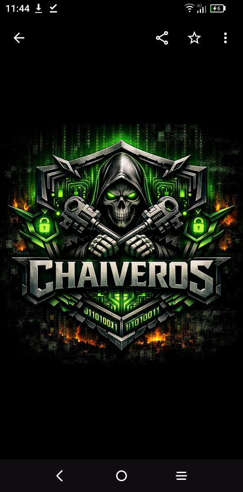

<div align="center">



# CHAVEIROS — Ransomware Defense

**Real-time ransomware key interception · Encrypted forensic log · Desktop app for Linux · macOS · Windows**

[](https://github.com/DeadmanXXXII/Ransomeware_Defense/actions/workflows/build.yml)
[](https://github.com/DeadmanXXXII/Ransomeware_Defense/releases)
[](LICENSE)

> ⚠️ **Authorised use only.** Deploy only on systems you own or have explicit written permission to monitor.
> See [DISCLAIMER.md](DISCLAIMER.md)

</div>

---

## How it works

```
All running processes on this system
            │
            ▼
┌───────────────────────────────────────────────────────┐
│  ⟁  Frida library hooks  → intercepts encryption calls │
│  ⊟  Packet capture       → flags key exfil bursts      │
│  ◈  Process monitor      → detects encryption sweeps   │
│  ⚙  Kernel scanner       → lowest-level key events     │
└───────────────────────────────────────────────────────┘
            │  intercepted key material
            ▼
  AES-256-GCM chain-hashed encrypted log
  (stays on this device — no external comms)
            │
            ▼
  Chaveiros desktop GUI
  Event Feed · Secure Log · Settings
```

**No hardcoded IPs. No external communications. Everything stays on the system it runs on.**

---

## Download

Go to [**Releases**](../../releases) and grab the installer for your OS:

| Platform | File | Notes |
|---|---|---|
| 🐧 Linux | `.AppImage` · `.deb` | Run with `sudo` for full capabilities |
| 🍎 macOS | `.dmg` | Right-click → Open on first launch |
| 🪟 Windows | `*Setup.exe` · `*Portable.exe` | Run as Administrator + install [Npcap](https://npcap.com) |

---

## First run

1. **Run as Administrator / sudo** — required for packet capture and kernel scanner
2. Open **Settings** → set a log passphrase (minimum 8 characters)
3. Return to **Dashboard** → press **▶ Start Scanning**
4. Watch events appear live in the **Event Feed** tab
5. Open **Secure Log** → enter passphrase to review the encrypted forensic log

---

## Capability matrix

| Feature | Linux | macOS | Windows |
|---|---|---|---|
| Frida library hooks | ✅ Any user | ✅ Any user | ✅ Any user |
| Packet capture | ✅ root / CAP_NET_RAW | ✅ root | ✅ Admin + Npcap |
| Process monitor | ✅ Any user | ✅ Any user | ✅ Any user |
| Kernel scanner | ✅ root | ⚠ SIP must be off | ⚠ Attestation signed |

---

## Repository structure

```
Ransomeware_Defense/
├── .github/workflows/          ← CI/CD — builds kernels + Electron app
│   ├── build.yml               ← fires on every push to main/dev
│   └── release.yml             ← fires on version tags (git tag v1.x.x)
│
├── app/                        ← Electron desktop app
│   ├── src/main/               ← Node.js main process
│   │   ├── scanner/            ← Frida · packet · process · kernel managers
│   │   ├── logger/             ← AES-256-GCM secure log
│   │   └── utils/              ← Privilege detection
│   ├── src/preload/            ← Hardened IPC context bridge
│   ├── src/renderer/           ← React UI (Dashboard · Events · Log · Settings)
│   └── resources/
│       ├── icons/              ← PNG · ICO · ICNS (all generated from logo)
│       └── kernel/             ← CI injects compiled .ko/.kext/.sys here
│
├── Linux-Kernel-Scanner.c      ← compiled by Linux CI runner → .ko
├── Mac-Kernel-Scanner.m        ← compiled by macOS CI runner → kext
├── Windows-Kernel-Scanner.cpp  ← validated by Windows CI runner → .sys
│
├── ChaveirosV3.py              ← Python key interceptor (CLI)
├── Listen-In.py                ← Python CISO key receiver (CLI)
├── De-ransomeware.py           ← File decryption recovery tool
├── Labyrinth_keys_generatorV6.py ← Fernet key generator GUI
├── config_loader.py            ← Centralised config (replaces hardcoded IPs)
├── config/config.yaml.example  ← Configuration template
├── scripts/                    ← OS install scripts (CLI tool)
├── docs/                       ← Platform notes + CI setup guide
├── requirements.txt            ← Python dependencies
├── Makefile                    ← Linux kernel module build
├── LICENSE                     ← MIT + Authorised Use clause
└── DISCLAIMER.md               ← Capability disclosure + legal notice
```

---

## Secure log format

The `.rwdlog` file is a binary append-only encrypted journal:

```
Each entry:
  [4B ] uint32 frame length
  [12B] AES-GCM nonce (random per entry)
  [16B] GCM authentication tag
  [N B] AES-256-GCM ciphertext of JSON event
```

Each JSON entry includes `prevHash` — the SHA-256 of the previous entry's ciphertext. This creates a tamper-evident chain: any modification breaks all subsequent hashes, visible in the Log Viewer.

**Key derivation:** PBKDF2-SHA256 · 210,000 iterations · 32-byte random salt stored separately from the log.

---

## Building from source

```bash
git clone https://github.com/DeadmanXXXII/Ransomeware_Defense.git
cd Ransomeware_Defense/app

npm install
npm run rebuild    # recompiles frida + cap native modules for Electron
npm run dev        # hot-reload development

# Production package
npm run package:linux
npm run package:mac
npm run package:win
```

---

## Platform notes

- **macOS 11+:** Kernel extension deprecated — Frida + packet capture still work fully. See [docs/macos-compat.md](docs/macos-compat.md)
- **Windows:** Kernel driver requires attestation signing via Microsoft Partner Center. See [docs/windows-signing.md](docs/windows-signing.md)
- **CI secrets:** See [docs/CI_SETUP.md](docs/CI_SETUP.md) for signing certificate setup

---

## Author

**Blu Corbel** · @TheMadHattersPlayground.com · [DeadmanXXXII](https://github.com/DeadmanXXXII)

Built from reverse-engineering of six ransomware samples — designed to catch the key before it leaves.
